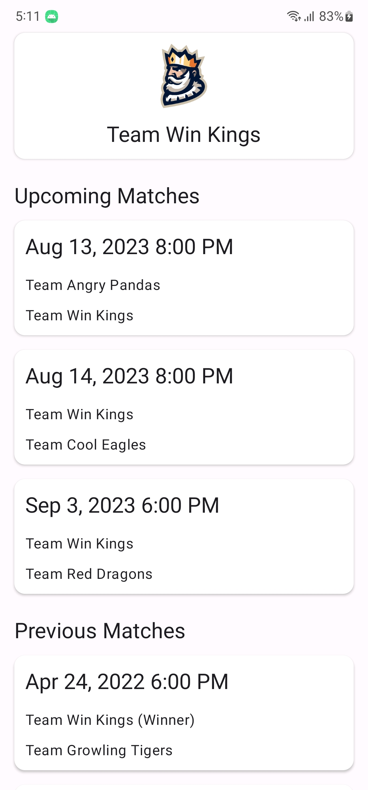

# Inspius Test

Home test project to apply for Android Developer position

## Table of contents

- [Demo](#demo)
- [Project architecture](#project-architecture)
- [Project Structure](#project-structure)
- [Library](#library)
- [If I had additional time](#if-i-had-additional-time)
- [How to build](#how-to-build)

## Demo

  
  
  
  
  
  
  

## Project architecture

MVVM with Clean Architecture

- Note: Controller is a component of Epoxy library that support to building a complex RecyclerView,
  Controller in the project act as an alternative to the RecyclerViewAdapter, not a layer in
  MVC. [Reference link](https://github.com/airbnb/epoxy/wiki/Epoxy-Controller)

The reason I use this architecture:

- This is my familiar architecture
- MVVM is recommend by Google
- Reduce dependency between layers when compare with standard MVVM
- Friendly package structure, when looking at a class, developer will understand immediately which package it
  belongs to
- Easy to test

## Project Structure

- **domain**: It contains all the model class and UseCase.
- **data**: Contribute data for domain layer.
- **di**: Dependency providing classes using Dagger Hilt.
- **Presentation**: View layer.
- **Platform**: Classes to handle the tasks belong to platform (Push notification, Set alarm,...).
- **Core**: Base classes.

## Library

- Coroutines - Handle async task
- Dagger Hilt - Dependency injection
- Retrofit - Execute API
- Android jetpack (ViewModel, Room, Lifecycle, Navigation,...)
- Epoxy - To implement complex RecyclerView
- ExoPlayer - Play video by URL
- Glide - Image loader
- Mockito, Truth - For testing purpose

## If I had additional time
I will build these features:

- Cached data for an interval - to prevent fetching API multiple times, and data can be displayed when the device has no internet
- Handle error
- Move ExoPlayer to Service, user can watch the highlights in Picture in picture mode
- Multi language
- UI test
- Tablet design
- Thinking...

## How to build

./gradlew :app:installDebug
